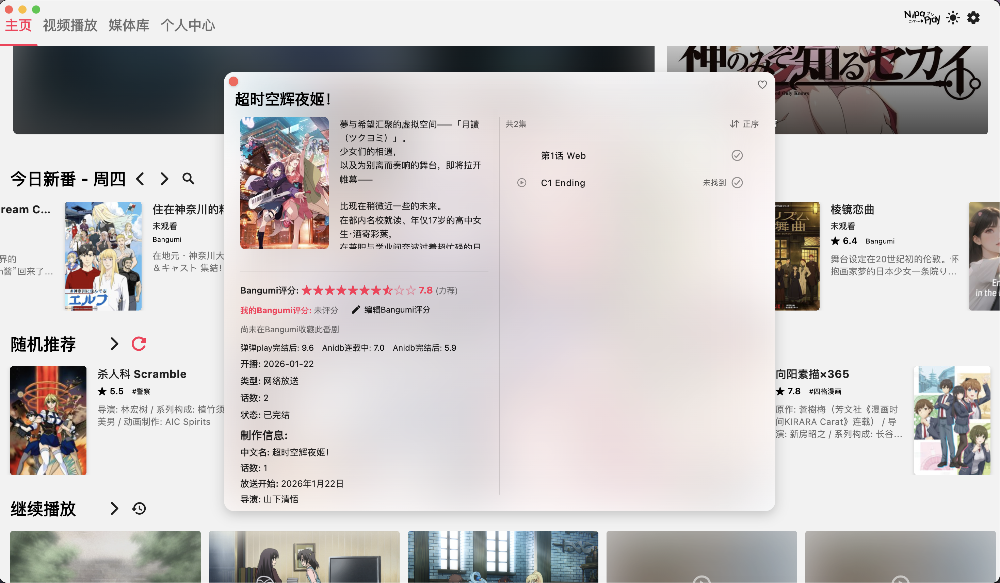
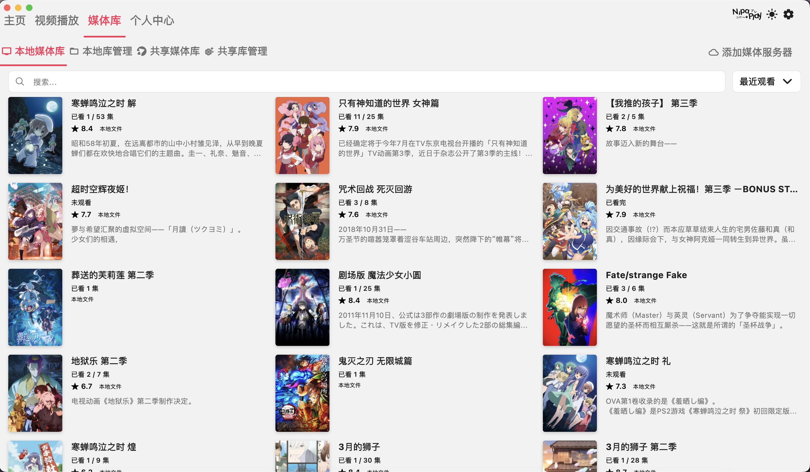
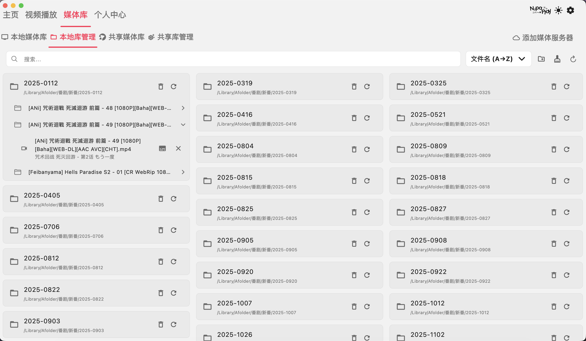

<div align="center">
  <div style="display: flex; align-items: center; justify-content: center;">
    
    
  </div>
  
  # NipaPlay-Reload

  
  
  <br>

  
  
  
  

  <br>

  
</div>

<div align="center">
  <h3>
    一个现代化的跨平台视频播放器应用
  </h3>
  <p>
    支持 Windows、macOS、Linux、Android 和 iOS 五大操作系统。
    <br>
    打造您的个人媒体中心，享受极致的追番体验。
  </p>
</div>

---

## 核心亮点

NipaPlay 不仅仅是一个播放器，更是您的二次元媒体管家：

*   **全平台支持**：无论是在电脑还是手机上，体验始终如一。
*   **强大的弹幕系统**：自动匹配网络弹幕，支持弹弹play，让看番不再孤单。
*   **媒体库集成**：支持 Emby、Jellyfin、SMB、WebDAV，轻松挂载远程资源。
*   **番剧管理**：同步 Bangumi 观看进度，查看新番时间表，打分评论一站式搞定。
*   **现代 UI**：毛玻璃风格设计，支持自动黑夜模式，美观与易用并重。

## 应用截图

<details>
<summary><b>点击展开查看更多截图</b></summary>

<div align="center">
  <table style="border: none;">
    <tr>
      <td align="center" style="border: none;">
        
        <br><b>主界面</b>
      </td>
      <td align="center" style="border: none;">
        
        <br><b>播放界面</b>
      </td>
    </tr>
    <tr>
      <td align="center" style="border: none;">
        
        <br><b>番剧详情界面</b>
      </td>
      <td align="center" style="border: none;">
        
        <br><b>流媒体详情页面</b>
      </td>
    </tr>
    <tr>
      <td align="center" style="border: none;">
        
        <br><b>媒体库界面</b>
      </td>
      <td align="center" style="border: none;">
        
        <br><b>库管理界面</b>
      </td>
    </tr>
  </table>
  
  <br><b>播放界面 UI 展示</b>
</div>

</details>

## 下载安装

支持 **Windows (x64)**、**Linux (amd64/arm64)**、**macOS (Intel/Apple Silicon)**、**Android** 和 **iOS**。

### 快速下载

- **GitHub Releases (推荐)**: [下载最新版本](https://github.com/mcdfsteve/nipaplay-reload/releases)
- **iOS (App Store)**: [点击下载](https://apps.apple.com/cn/app/nipaplay/id6751284970)

### 包管理器安装

#### macOS (Homebrew)
```bash
brew tap Shinokawa/nipaplay-reload
brew install --cask nipaplay-reload
```

#### Arch Linux (AUR)
```bash
paru -S nipaplay-reload-bin
# 或
yay -S nipaplay-reload-bin
```

#### Gentoo Linux
```bash
ebuild gentoo/media-video/nipaplay-bin/nipaplay-bin-1.8.11.ebuild merge
```

## 功能列表

### 播放体验
*   **内核支持**：基于 fvp (libmdk) / media_kit / video_player / libmpv，性能强劲。
*   **视频支持**：本地播放、Emby/Jellyfin 流媒体、WebDAV 挂载。
*   **画质增强**：支持 Anime4K 超分（实验性）、CRT 着色器效果。
*   **音频控制**：多音轨切换、倍速播放。

### 弹幕与字幕
*   **弹幕**：滚动/顶底弹幕、轨迹记忆、防遮挡、本地挂载 (xml/json)。
*   **字幕**：ASS/SRT 格式、多轨切换、样式自定义、本地挂载。

### 番剧与同步
*   **Bangumi**：进度同步、评分、评论。
*   **新番表**：每日更新提醒，按周分类。
*   **数据备份**：历史记录同步、多设备远程访问。

### 个性化
*   **主题**：亮色/暗色切换、自定义背景图。
*   **操作**：自定义快捷键、适配平板/电视布局。

## 文档与支持

*   **[完整使用文档](Documentation/index.md)**：安装配置、Emby 连接教程、故障排查。
*   **[贡献者指南](CONTRIBUTING_GUIDE/00-Introduction.md)**：如何参与开发、添加新功能。
*   **反馈问题**：请在软件内的“开发者选项”中导出日志，或在 GitHub Issues 中提交。

## 技术栈

本项目基于 **Flutter** 构建，使用了以下核心技术：

| 类别 | 技术/库 |
| :--- | :--- |
| **核心框架** | Flutter, Dart |
| **播放引擎** | FVP, Media Kit, libmpv |
| **UI/UX** | Material Design, Glassmorphism, Hugeicons |
| **状态管理** | Provider |
| **数据存储** | SQLite, SharedPreferences |
| **网络 API** | Dio/Http, Bangumi API, 弹弹play API |

## 开发计划 (Roadmap)

- [ ] 评论区功能完善
- [ ] 云媒体库挂载 (FTP)
- [ ] 视频片段导出 (GIF)
- [ ] 内置下载器及远程控制
- [ ] 在线 URL 播放优化
- [ ] Webview 弹幕刮削
- [ ] 补帧功能 (SVP/Other)
- [ ] HDR 和杜比视界支持
- [ ] 鸿蒙 OS / Vision Pro / Apple TV 移植

## 赞助与鸣谢

如果这个项目对您有帮助，欢迎赞助以支持服务器运行和后续开发！

<div style="display: flex; gap: 20px;">
  <a href="https://afdian.com/a/irigas" target="_blank">
    
  </a>
  
</div>

### 鸣谢
感谢以下贡献者和支持者：
EmoSakura, Mr.果仁, 姬田诗乃, 微光, 大祥老师, 卡拜

### 看板娘
[Pixiv Artwork](https://www.pixiv.net/artworks/130349456) (作者 MCDFsteve)

---

<div align="center">
  <sub>Made with ❤️ by the NipaPlay Team</sub>
</div>
