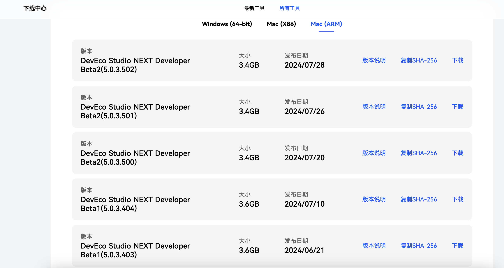

# OpenHarmony版Flutter环境搭建指导
 
## 1. 环境准备

### 1.1 下载并安装OpenHarmony最新DevEco Studio开发工具，及其依赖环境

#### 1.1.1 官方下载地址

[OpenHarmony开发套件官方下载地址](https://developer.huawei.com/consumer/cn/download/)  

注意事项：

1. 目前支持操作系统Linux、Mac、Windows环境下使用。
2. mac系统在终端输入 `uname -m` 判断系统架构选择对应的开发组件套
    如果输出结果是 x86_64，则表示你的系统是x86-64架构
    如果输出结果是 arm64，则表示你的系统是arm64架构。

#### 1.1.2 下载清单

1. 根据自身所用电脑系统下载对应最新版DevEco Studio。

    


2. 若无OpenHarmony真机，需在DevEco Studio中下载模拟器。
模拟器下载和安装步骤见：[安装模拟器](#### 2.2 安装模拟器)  

3. 下载OpenHarmony版 [flutter](https://gitcode.com/openharmony-tpc/flutter_flutter)。

    通过代码工具下载仓库代码并指定dev或master分支，dev不断在更新相比master拥有更多功能。
    ```
    git clone https://gitcode.com/openharmony-tpc/flutter_flutter.git
    git checkout -b dev origin/dev
    ```

4. 下载FlutterEngine构建产物（非必选项）。

    * 构建Hap命令直接执行 flutter build hap 即可，不再需要 --local-engine 参数，直接从云端获取编译产物。

#### 1.1.3 OpenHarmony开发环境的前置环境依赖

* 由于OpenHarmony系统sdk存在java环境依赖，在[oracle官网](https://www.oracle.com/cn/java/technologies/downloads/#java17)或openjdk官网下载jdk 17环境，并进行相应配置。

* 执行如下命令，检查JDK安装结果，安装成功后进行后续操作。

  ```sh
  java -version
  ```

## 2. 安装说明

### 2.1 解压组件套压缩包后点击DevEco Studio的安装包文件，完成DevEco Studio开发工具的安装。


### 2.2 安装模拟器


### 2.3 环境变量配置

* 首先，利用终端工具确定不同系统的真实环境变量存储路径，执行如下命令：

  ```sh
  echo $SHELL 
  ```

* 若上述命令输出结果为`/bin/bash`，则执行以下命令，打开.bash_profile文件。

  ```sh
  vi ~/.bash_profile
  ```

* 若上述命令输出结果为`/bin/zsh`，则执行以下命令，打开.zshrc文件。

  ```sh
  vi ~/.zshrc
  ```

* 确定了环境变量存储文件后，进行相关环境变量配置（例如，打开bash_profile文件，执行`vi ～/.bash_profile`命令）。

  ```sh
  # 国内镜像
  export PUB_HOSTED_URL=https://pub.flutter-io.cn
  export FLUTTER_STORAGE_BASE_URL=https://storage.flutter-io.cn

  # 拉取下来的flutter_flutter/bin目录
  export PATH=/Users/admin/ohos/flutter_flutter/bin:$PATH

  # OpenHarmony SDK
  export TOOL_HOME=/Applications/DevEco-Studio.app/Contents # mac环境
  export DEVECO_SDK_HOME=$TOOL_HOME/sdk # command-line-tools/sdk
  export PATH=$TOOL_HOME/tools/ohpm/bin:$PATH # command-line-tools/ohpm/bin
  export PATH=$TOOL_HOME/tools/hvigor/bin:$PATH # command-line-tools/hvigor/bin
  export PATH=$TOOL_HOME/tools/node/bin:$PATH # command-line-tools/tool/node/bin
  export HDC_HOME=$TOOL_HOME/sdk/default/openharmony/toolchains # hdc指令（可选）

  # 可选配置项(使用Android Studio 或者 Visual Studio Code调试时需要配置此项，jdk版本为17.0.12)
  JAVA_HOME=/Users/admin/Documents/JDK/jdk-17.0.12.jdk/Contents/Home
  PATH=$JAVA_HOME/bin:$PATH:.
  export JAVA_HOME
  export PATH

  # 可选配置项（防止由于Flutter OpenHarmony版的git下载地址环境变量不匹配，影响后续的flutter项目创建）
  export FLUTTER_GIT_URL=https://gitcode.com/openharmony-tpc/flutter_flutter.git

  # 非必选配置项（若command-line-tools目录下的tool文件里存在node环境，则无需配置，若无则可进行如下单独配置）
  # export NODE_HOME=/Users/admin/node/node-18.14.1
  # export PATH=$PATH:$NODE_HOME/bin
  ```

* 全部所需环境变量配置完成后，执行如下命令刷新环境配置，使其生效。

  ```sh
  source ~/.bash_profile
  ```

### 2.4 运行模拟器


创建模拟器


准备启动模拟器


模拟器运行效果


## 3.集成与调试OpenHarmony版Flutter

### 3.1 检查环境

运行`flutter doctor -v`检查环境变量配置是否正确，Futter与OpenHarmony应都为ok标识，若两处提示缺少环境，按提示补上相应环境即可。


### 3.2 创建Flutter工程

创建工程与编译命令，编译产物在 `${projectName}/ohos/entry/build/default/outputs/default/entry-default-signed.hap` 下。

```sh
# 创建工程 方式一 该方式只创建了ohos平台
flutter create --platforms ohos <projectName> 

# 创建工程 方式二 该方式创建了android,ios,ohos三个平台
flutter create  <projectName> 

# 进入工程根目录编译hap包
flutter build hap --debug
```

### 3.3 OpenHarmony真机运行Flutter项目

#### 3.3.1 项目签名

在运行到真机之前，需要对项目进行签名，具体操作如下：


#### 3.3.2 OpenHarmony真机运行Flutter项目

通过`flutter devices`指令发现真机设备之后，获取device-id。

方式一：进入项目目录指定构建方式编译hap包并安装到OpenHarmony手机中。

```sh
 flutter run --debug -d <deviceId>
```

方式二：进入工程根目录编译hap包,然后安装到OpenHarmony手机中。

```sh
 flutter build hap --debug
 hdc -t <deviceId> install <hap file path>
```

方式三：使用DevEcoStudio 选择设备为真机，点击启动。


### 3.4 模拟器运行Flutter项目

#### 3.4.1 使用DevEcoStudio打开项目的ohos模块


#### 3.4.2 DevEcoStudio启动OpenHarmony模拟器


切换设备为OpenHarmony模拟器


#### 3.4.3 点击编译运行


### 3.5 模拟器运行常见问题

#### 3.5.1 无法创建模拟器

情况1：使用实名制认证的账号进行签名

#### 3.5.2 Windows或Mac x86架构无法运行模拟器
 由于模拟器当前仅支持Mac arm架构，且flutter应用尚未适配x86架构，因此在Windows或Mac的x86运行模拟器会遇到限制。
 
### 3.6 pub upgrade常见问题

#### 3.6.1 pub upgrade耗时较长

情况1：首次加载因为需要拉取的文件较多，根据自身网络情况所需花费的时间有较大差异，请耐心等待,如果下载失败，建议检查网络连接或更换代理后再次尝试。
  
情况2：删除 `flutter_flutter/bin/cache` 文件后重试。
  
情况3：更换镜像源，如：

```
PUB_HOSTED_URL=https://mirrors.tuna.tsinghua.edu.cn/dart-pub
FLUTTER_STORAGE_BASE_URL=https://mirrors.tuna.tsinghua.edu.cn/flutter
```